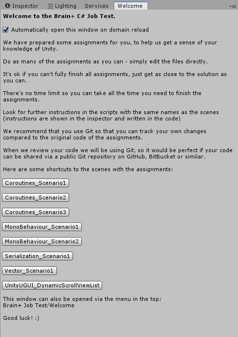
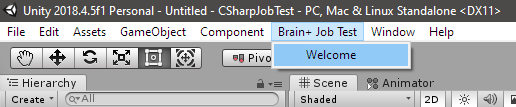

# Brain+ Unity Developer Job Test
Thank you for showing an interest in taking our Unity Developer job test!

This repository was created using `Unity 2018.4.5f1`, but it might work for newer versions of Unity as well.

When you open up the project in Unity, a Welcome window should appear with further instructions.

The Welcome window is also available in the top menu under: "Brain+ Job Test/Welcome".

We have prepared some assignments for you, to help us get a sense of your knowledge of Unity.

Do as many of the assignments as you can - simply edit the files directly.

It's ok if you can't fully finish all assignments, just get as close to the solution as you can.

There's no time limit so you can take all the time you need to finish the assignments.

Look for further instructions in the scripts with the same names as the scenes (instructions are shown in the inspector and written in the code)

We recommend that you use Git so that you can track your own changes compared to the original code of the assignments.

When we review your code we will be using Git, so it would be perfect if your code can be shared via a public Git repository on GitHub, BitBucket or similar.

Good luck! :)
